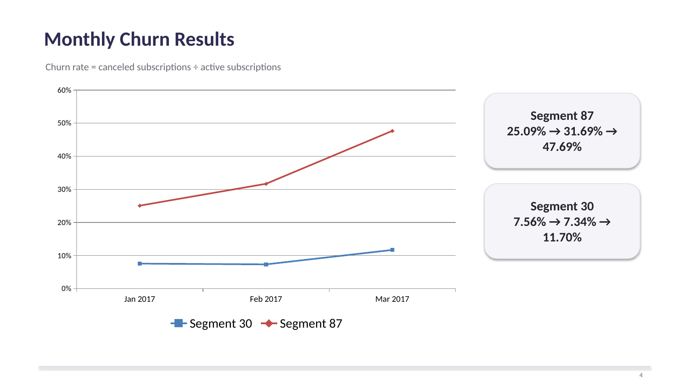
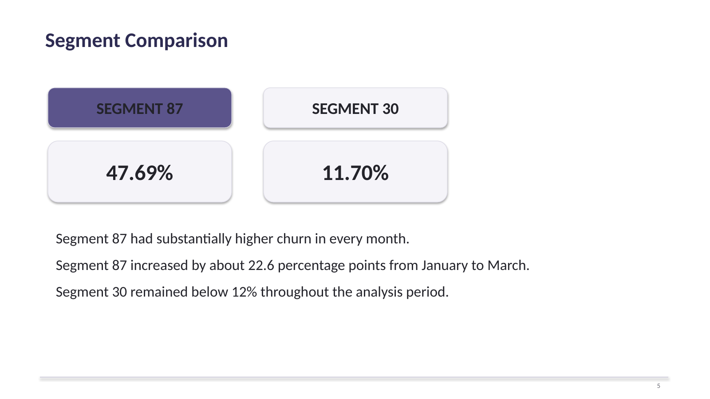
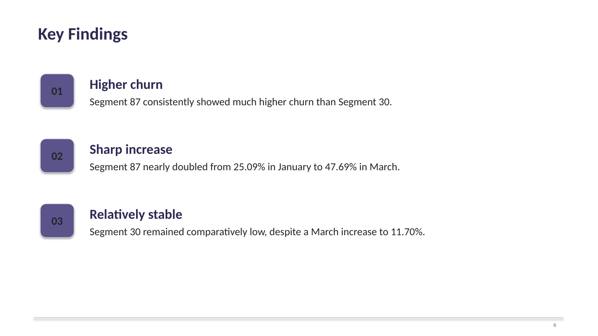

# Codeflix Churn Analysis

## Project Overview

This project analyzes subscription churn for Codeflix, a fictional streaming service, using SQL.

The analysis examines monthly churn rates across customer segments 30 and 87 from January through March 2017. The goal is to identify differences in customer retention and determine which segment requires greater attention.

The project demonstrates how SQL can be used to transform subscription-level data into actionable business insights.

## Business Question

How does subscriber churn vary between Codeflix customer segments, and which segment shows the greatest retention challenge?

## Key Findings

- Segment 87 experienced substantially higher churn than Segment 30 in every month analyzed.
- Segment 87's churn rate increased from **25.09% in January** to **47.69% in March**.
- Segment 30 remained comparatively stable, with churn ranging from **7.34% to 11.70%**.
- The results indicate that **Segment 87 represents the clearest customer-retention challenge**.

| Month | Segment 30 | Segment 87 |
|---|---:|---:|
| January 2017 | 7.56% | 25.09% |
| February 2017 | 7.34% | 31.69% |
| March 2017 | 11.70% | 47.69% |

## Methodology

The analysis uses a series of Common Table Expressions (CTEs) to calculate monthly churn.

### 1. Define Monthly Periods

Three monthly date ranges were created for January, February, and March 2017.

### 2. Cross Join Subscriptions with Monthly Periods

Each subscription was evaluated against each month to determine its status during that period.

### 3. Identify Active Subscriptions

A subscription was considered active at the beginning of a month when:

- The subscription started before the first day of the month.
- The subscription ended on or after the first day of the month, or had no recorded end date.

### 4. Identify Canceled Subscriptions

A subscription was considered canceled when its subscription end date fell within the corresponding month.

### 5. Aggregate by Month and Segment

Active and canceled subscriptions were grouped by month and customer segment.

### 6. Calculate Churn Rate

Churn rate was calculated as:

**Churn Rate = Canceled Subscriptions / Active Subscriptions**

The final results were calculated separately for each customer segment and month.

## SQL Techniques Used

- Common Table Expressions (CTEs)
- `CROSS JOIN`
- `CASE` expressions
- `SUM()`
- `GROUP BY`
- Date filtering
- Conditional logic
- Calculated fields
- Ratio calculations

## Results & Interpretation

### Segment 87

Segment 87 showed a significant deterioration in retention during the three-month period:

**25.09% → 31.69% → 47.69%**

From January to March, the churn rate increased by approximately **22.6 percentage points**.

### Segment 30

Segment 30 maintained substantially lower churn:

**7.56% → 7.34% → 11.70%**

Although churn increased in March, it remained below 12% throughout the analysis period.

### Segment Comparison

The difference between the two segments is consistent and substantial. Segment 87 had higher churn than Segment 30 in all three months.

However, this analysis identifies **where** the retention problem occurs, not **why** it occurs. Additional customer-level or behavioral data would be required to determine the underlying causes.

## Recommendation

Codeflix should prioritize further investigation of **Segment 87**.

Potential areas for follow-up analysis include:

- Customer engagement and viewing behavior
- Subscription pricing
- Customer demographics
- Acquisition channels
- Subscription tenure
- Customer support interactions
- Changes in product or service experience

Further analysis would help determine which factors are associated with the elevated churn rate in Segment 87.

## Presentation

The complete analysis is presented in the accompanying PowerPoint presentation.

**[View the full presentation](presentation/Codeflix_Churn_Rate_Analysis.pptx)**

### Selected Presentation Slides

#### Monthly Churn Results



#### Segment Comparison



#### Key Findings



## Project Structure

```text
codeflix-churn-analysis/
│
├── README.md
├── churn_rate.sql
│
├── presentation/
│   └── Codeflix_Churn_Rate_Analysis.pptx
│
└── screenshots/
    ├── slide-04-results.png
    ├── slide-05-comparison.png
    └── slide-06-findings.png
